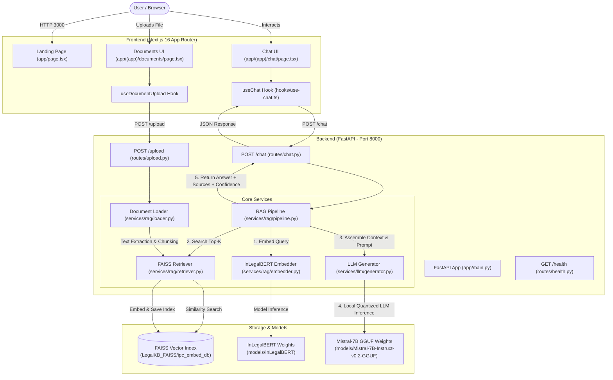

# LegalEagle — Production Readiness Audit Report

> **Auditor Roles**: Senior Software Architect · Staff Backend Engineer · DevOps Engineer · QA Engineer · Product Reviewer  
> **Date**: September 17, 2026  
> **Repository**: `LegalEagle` (cynxtl/LegalEagle)  
> **Target Environment**: Production Deployment Readiness  

---

## Executive Summary

**LegalEagle** is an AI-powered legal research assistant for Indian law, originally created as a Streamlit application and recently expanded with a Next.js 16 frontend and FastAPI backend.

While the application demonstrates strong architectural vision and high UI design quality, it is currently **not production-ready**. Crucial machine learning model weights are missing from the repository, database storage and user authentication are entirely absent, major frontend pages rely on static mock data, the vector database stores raw text without citation metadata, and the underlying legal dataset relies on repealed colonial criminal statutes (IPC/CrPC) rather than the active Bharatiya Nyaya Sanhita (BNS, 2023).

- **MVP Readiness**: **45%**
- **Production Readiness**: **20%**

---

## 1. Repository Analysis

```
LegalEagle (Root)
├── backend/                       # FastAPI application
│   ├── app/
│   │   ├── core/                  # Configuration & settings (pydantic-settings)
│   │   ├── models/                # Pydantic schemas (Chat, Upload, Health)
│   │   ├── routes/                # API Endpoints (/chat, /upload, /health)
│   │   ├── services/
│   │   │   ├── llm/               # Generator (CTransformers + Mistral-7B GGUF)
│   │   │   └── rag/               # Embedder, Retriever, Loader, RAG Pipeline
│   │   └── utils/
│   └── requirements.txt
├── frontend/                      # Next.js 16 App Router application
│   ├── app/                       # Landing page & (app) route group (chat, docs, sources, settings)
│   ├── components/                # Legal domain components & Shadcn/Radix UI primitives
│   ├── hooks/                     # Custom hooks (useChat, useDocumentUpload, useSettings)
│   ├── lib/                       # TypeScript interfaces & sample mock data (legal-data.ts)
│   └── package.json
├── LegalKB_FAISS/                 # Pre-built FAISS vector store index (ipc_embed_db)
├── mini_dataset/                  # Mini legal Q&A dataset, cases, and legal dictionary
├── models/                        # Directories for InLegalBERT & Mistral-7B GGUF weights
└── docs/                          # Architecture, API, Models, Setup, and Security docs
```

### High-Level Architecture & Data Flow



### Module Breakdown

1. **Frontend**: Next.js 16.2.4 App Router, React 19, Tailwind CSS v4, Radix UI. Built with TypeScript interfaces (`frontend/lib/legal-data.ts`).
2. **Backend**: FastAPI with `pydantic-settings`. Configured via `LEGALEAGLE_` environment variables in `backend/app/core/config.py`.
3. **Embeddings**: `InLegalBERTEmbeddings` (`backend/app/services/rag/embedder.py`), producing 768-dimensional embeddings via Hugging Face `law-ai/InLegalBERT` with mean pooling.
4. **Vector Store**: `FAISSRetriever` (`backend/app/services/rag/retriever.py`) reading pre-built FAISS CPU index files from `LegalKB_FAISS/ipc_embed_db`.
5. **Document Processing**: `loader.py` supporting `.pdf` (PyPDF2), `.docx` (python-docx), and `.txt`, chunked via `RecursiveCharacterTextSplitter` (1000 chars, 100 overlap).
6. **LLM Generation**: `LLMGenerator` (`backend/app/services/llm/generator.py`) wrapping `CTransformers` to run `Mistral-7B-Instruct-v0.2.Q4_K_M.gguf` locally.

---

## 2. Execution Audit

### Current Run Capability: ⚠️ Degraded / Demo Mode Only
The system **cannot run in full model inference mode** out of the box because large neural model weights are not committed to Git. However, it can run in **Demo Mode** with mock responses.

### Required Run Commands

**1. Backend Execution (Demo Mode)**:
```powershell
# From repository root
python -m venv .venv
.\.venv\Scripts\activate
pip install -r backend/requirements.txt
$env:LEGALEAGLE_DEMO_MODE="true"
python -m uvicorn backend.app.main:app --host 127.0.0.1 --port 8000 --reload
```

**2. Frontend Execution**:
```powershell
cd frontend
npm install
npm run dev
```

### Dependency Audit & Missing Items
- **Obsolete Root Dependencies**: `requirements.txt` in the root folder contains `streamlit==1.32.0`. Streamlit is no longer used in the codebase and should be removed.
- **Missing Backend Dependencies**: Missing `huggingface_hub` for automated weight downloading, and missing production process managers (`gunicorn`).
- **Required Environment Variables**:
  - Backend: `LEGALEAGLE_HOST` (default `0.0.0.0`), `LEGALEAGLE_PORT` (default `8000`), `LEGALEAGLE_DEMO_MODE` (default `false`), `LEGALEAGLE_CORS_ORIGINS` (default `["*"]`).
  - Frontend: `NEXT_PUBLIC_API_URL` (default `http://127.0.0.1:8000`).

### Missing Model Weights
1. **InLegalBERT Weights**: `law-ai/InLegalBERT` -> expected at `models/InLegalBERT/pytorch_model.bin` or `model.safetensors` (~440 MB).
2. **Mistral-7B GGUF**: `TheBloke/Mistral-7B-Instruct-v0.2-GGUF` -> expected at `models/Mistral-7B-Instruct-v0.2-GGUF/mistral-7b-instruct-v0.2.Q4_K_M.gguf` (~4.37 GB).

### Missing Files
- Dockerfiles (`Dockerfile`, `docker-compose.yml`).
- Environment variable templates (`.env.example` in backend and frontend).
- Database migration directory (`alembic` or `prisma`).
- Automated model download script.

---

## 3. Frontend Audit

### Backend Connectivity
- **Connected**: `use-chat.ts` connects `sendMessage()` to `POST ${NEXT_PUBLIC_API_URL}/chat`.
- **Connected**: `use-document-upload.ts` connects `uploadFile()` to `POST ${NEXT_PUBLIC_API_URL}/upload`.

### Unconnected Pages & Placeholder Elements
| Page / Component | Connection Status | Details / Placeholders |
| :--- | :--- | :--- |
| `app/(app)/chat/page.tsx` | **Partially Connected** | Chat messages send to API, but category is hardcoded to `"Property"`, thread title is static, and header buttons ("India" jurisdiction, "Filters", "Suggest follow-ups") are non-functional UI elements. |
| `app/(app)/documents/page.tsx` | **Unconnected (Mock UI)** | File upload adds file to local list, but the "Now Analyzing" pane, AI summary, Key parties, Risk flags, and Extracted clauses are **hardcoded mock data** for `sampleDocs[0]`. |
| `app/(app)/sources/page.tsx` | **Unconnected (Mock UI)** | Displays static `allSources` array. Search and Star buttons have no state persistence or backend synchronization. |
| `app/(app)/settings/page.tsx` | **Unconnected (Mock UI)** | Form inputs (Profile, Jurisdiction, AI switches, Billing, Delete workspace) are cosmetic components without backend state handlers or API routes. |
| `app/page.tsx` (Landing Page) | **Unconnected Links** | "Sign in" and "Talk to sales" links point to dummy `#` or `/chat`. No authentication screen exists. |

---

## 4. Backend Audit

### Backend Architecture
- **Real Backend**: Yes, a FastAPI application exists under `backend/app/`.
- **Streamlit Extraction**: The legacy `app.py` Streamlit script was successfully removed, but `streamlit` remains in the root `requirements.txt`.

### Key Backend Architectural Weaknesses
1. **Global Mutable Singletons**: In `backend/app/main.py`, service instances (`_embedder`, `_retriever`, `_generator`, `_pipeline`) are initialized as global variables during lifespan startup. This prevents multi-worker process scaling (e.g. `uvicorn -w 4`).
2. **Synchronous Blocking Inference**: `CTransformers` execution in `LLMGenerator` runs synchronously inside the FastAPI thread context, blocking worker threads during token generation.
3. **Local Disk Persistence**: FAISS index is stored on the local disk system (`LegalKB_FAISS/ipc_embed_db`), breaking containerized, stateless, or multi-instance deployments.
4. **Missing Data Layer**: Absence of database ORM (SQLAlchemy / Tortoise / Prisma) for persistent threads, chat history, user documents, or account credentials.

---

## 5. RAG Pipeline Audit

| RAG Component | Current Implementation | Identified Weaknesses & Risks |
| :--- | :--- | :--- |
| **Embedding Model** | `InLegalBERT` (768-dim, mean pooling) | Tokenizer max length is set to 512, but document chunking is set to 1000 characters, leading to silent text truncation during embedding. |
| **Vector Database** | FAISS CPU Local Index | Local file-based vector store. Cannot scale horizontally or support multi-tenant metadata filtering. |
| **Retrieval Strategy** | Dense L2 Vector Similarity (`top_k=3`) | Basic similarity search without sparse (BM25) hybrid matching, reranking, or metadata filtering. |
| **Chunking Strategy** | `RecursiveCharacterTextSplitter` (1000/100) | Arbitrary character splitting ignores legal document semantics (Acts, Sections, Articles, Sub-clauses, Paragraphs). |
| **Prompt Strategy** | Mistral `[INST]` Template | Fixed prompt format; lacks dynamic instruction adaptation per practice area or task type. |
| **Citations** | Fabricated Heuristic Metadata | FAISS index stores raw text strings without metadata. `_infer_metadata()` uses basic string rules (`Q:`, `Section`, `v.`) to invent default titles ("Indian Penal Code Reference"). Case citations, courts, and years are lost. |
| **Memory** | Stateless Client-Side History | Frontend sends up to 6 prior messages (truncated to 200 chars). Backend maintains no session state. |

---

## 6. Data Audit

### Legal Dataset Status
- **Current Legal Files**: `indian_legal_basics.txt`, `legal_cases.txt`, `legal_dictionary.txt`, `mini_dataset/`.
- **Pre-built Index**: `LegalKB_FAISS/ipc_embed_db` (310 KB).

### 🚨 Critical Issue: Outdated Colonial Laws (IPC vs. BNS)
The datasets and FAISS vector index in this repository rely exclusively on the **Indian Penal Code (IPC, 1860)**, **Code of Criminal Procedure (CrPC, 1973)**, and **Indian Evidence Act (1872)**.

On **July 1, 2024**, India officially replaced these colonial statutes with modern criminal legislation:
1. **Bharatiya Nyaya Sanhita (BNS, 2023)** — replaced IPC
2. **Bharatiya Nagarik Suraksha Sanhita (BNSS, 2023)** — replaced CrPC
3. **Bharatiya Sakshya Adhiniyam (BSA, 2023)** — replaced Indian Evidence Act

> [!CAUTION]
> **Legal Liability Risk**: LegalEagle currently contains zero coverage of BNS, BNSS, or BSA provisions. Any legal query processed regarding criminal offences committed on or after July 1, 2024 will generate outdated, legally inaccurate advice citing repealed statutes.

---

## 7. Production Readiness Audit

| Category | Status | Summary / Deficiencies |
| :--- | :---: | :--- |
| **Frontend** | ⚠️ **Partially Working** | Next.js 16 UI is well-designed, but Documents, Sources, and Settings pages rely on static mock data. |
| **Backend** | ⚠️ **Partially Working** | FastAPI service operates in degraded/demo mode; uses global singletons; lacks DB and auth. |
| **Authentication** | ❌ **Missing** | Zero authentication, JWT middleware, or session management. Endpoints are completely open. |
| **Database** | ❌ **Missing** | No relational database for users, threads, messages, or uploaded document metadata. |
| **Vector Store** | ⚠️ **Partially Working** | Local FAISS index works for local demo, but lacks cloud persistence, metadata filtering, and sync. |
| **Upload System** | ⚠️ **Partially Working** | Basic PDF/DOCX text extraction works, but processed files are not stored in a persistent DB or cloud bucket. |
| **RAG Pipeline** | ⚠️ **Partially Working** | Functional in demo mode, but suffers from fabricated citation metadata, lack of reranking, and outdated IPC data. |
| **Monitoring** | ❌ **Missing** | No APM, Sentry error logging, Prometheus metrics, or LLM evaluation tracking (LangSmith). |
| **Logging** | ⚠️ **Partially Working** | Standard Python stdout logging. Lacks structured JSON format and centralized log aggregation. |
| **Security** | 🔴 **Broken** | Wildcard CORS (`*`), no rate limiting, prompt injection vulnerability, dangerous FAISS deserialization flag. |
| **Testing** | ❌ **Missing** | Zero unit tests, integration tests, or API contract test suites present in the codebase. |
| **Deployment** | ❌ **Missing** | No Dockerfiles, docker-compose, CI/CD GitHub Actions, or infrastructure configuration files. |

---

## 8. Bugs and Risks

### 🔴 Critical Blockers
1. **Missing Neural Model Weights**: Model weights for InLegalBERT and Mistral GGUF are missing from `models/`, causing full backend mode to fail on startup.
2. **Absence of Database & Auth**: All chat sessions are ephemeral; documents and thread histories cannot be saved per user.
3. **Repealed Legal Code Risk (IPC vs. BNS)**: Vector database uses outdated IPC laws instead of active Bharatiya Nyaya Sanhita (BNS 2023).

### ⚠️ High-Priority Issues
1. **Fabricated Source Metadata**: FAISS index stores raw text strings; `_infer_metadata()` invents fallback titles without real case citations.
2. **Local FAISS Single-Node Limitation**: Local disk index prevents multi-instance cloud deployments and container scaling.
3. **Synchronous LLM Execution**: `CTransformers` blocks the FastAPI async event loop, choking throughput under concurrent requests.
4. **Wildcard CORS Configuration**: `allow_origins=["*"]` allows cross-origin requests from any arbitrary domain.

### 🟡 Medium-Priority Issues
1. **Hardcoded UI State**: Chat page forces category to `"Property"` and thread title to static text in `useChat.sendMessage()`.
2. **Chunk Size / Tokenizer Mismatch**: 1000-character chunks exceed InLegalBERT's 512 max token limit.
3. **Obsolete Dependencies**: Root `requirements.txt` contains unused `streamlit==1.32.0`.
4. **No Rate Limiting**: Absence of rate limiting leaves server vulnerable to API abuse and resource exhaustion.

### 🟢 Low-Priority Issues
1. **Unused Model Directory**: `models/phi-2-GGUF` exists without active backend integration.
2. **Missing Streaming (SSE)**: Chat UI waits for complete LLM response generation instead of streaming tokens in real time.

---

## 9. Deployment Readiness Score

```
MVP Readiness         [██████████░░░░░░░░░░] 45%
Production Readiness  [████░░░░░░░░░░░░░░░░] 20%
```

### Score Rationale
- **MVP Readiness (45%)**: The project has a working FastAPI backend structure and a modern Next.js UI that communicates with `/chat` and `/upload` in Demo Mode. However, because neural model weights are absent, user management is missing, and secondary UI pages are static mockups, it cannot be handed over to users as a self-contained MVP without developer setup.
- **Production Readiness (20%)**: Complete lack of authentication, database storage, cloud vector store, containerization, CI/CD, rate limiting, monitoring, automated testing, and compliance with 2024 Indian criminal law reforms (BNS/BNSS/BSA).

---

## 10. Action Plan

```mermaid
timeline
    title Production Readiness Roadmap
    section Phase 1 : Runnable Local Dev
        Download Script for Model Weights : InLegalBERT & Mistral GGUF
        Cleanup Root Requirements : Remove Streamlit
        Fix Token/Chunk Mismatch : Adjust InLegalBERT chunking
        Add .env.example Files : Backend & Frontend
    section Phase 2 : Beta Release
        PostgreSQL DB & ORM : Users, Threads, Messages, Documents
        JWT Authentication : Signup, Login, Protected Routes
        BNS / BNSS Data Ingestion : Re-index modern 2024 Indian legal codes
        Rich Metadata Indexing : Store Title, Citation, Year, Section in Vector DB
        Connect Frontend UI : Wire up Documents, Sources, Settings pages
    section Phase 3 : Production Launch
        Managed Vector DB Migration : Qdrant / pgvector / Pinecone
        vLLM / Inference Server : Async GPU inference & SSE Streaming
        Security & Rate Limiting : Redis rate limits, strict CORS, input sanitization
        Dockerization & CI/CD : Multi-stage Dockerfiles & GitHub Actions
    section Phase 4 : Future Enhancements
        Hybrid Search & Reranking : BM25 + Dense + Cohere Reranker
        Multi-Jurisdiction Expansion : US / UK / EU corpora integration
        Observability & Analytics : Sentry, Prometheus, LangSmith tracking
```

### Phase 1: Must Fix Before Project Can Run (Local Dev)
- [ ] Create `scripts/download_models.py` using `huggingface_hub` to download InLegalBERT and Mistral GGUF weights into `models/`.
- [ ] Remove `streamlit==1.32.0` from root `requirements.txt`.
- [ ] Update `backend/app/services/rag/loader.py` chunk size to 400 characters (matching InLegalBERT's 512 token limit).
- [ ] Add `.env.example` templates for both backend and frontend environments.

### Phase 2: Must Fix Before Beta Release (Core Functionality & Data Integrity)
- [ ] Implement PostgreSQL database with SQLAlchemy ORM for `User`, `Thread`, `Message`, and `Document` models.
- [ ] Add JWT authentication endpoints (`/auth/register`, `/auth/login`, `/auth/me`) and protect `/chat` and `/upload` routes.
- [ ] Ingest Bharatiya Nyaya Sanhita (BNS, 2023), BNSS (2023), and BSA (2023) datasets alongside IPC/CrPC cross-references.
- [ ] Upgrade vector DB indexing pipeline to preserve rich metadata (Act, Section, Citation, Year, Jurisdiction) with every chunk.
- [ ] Connect Next.js Documents page, Saved Sources library, and Settings page to live backend REST endpoints.

### Phase 3: Must Fix Before Production (Scalability, Security & Infra)
- [ ] Migrate vector store from local FAISS files to a managed/distributed vector database (Qdrant, pgvector, or Pinecone).
- [ ] Offload LLM generation to an inference server (vLLM / Ollama / TGI) or cloud provider API, and implement Server-Sent Events (SSE) for streaming text responses to the UI.
- [ ] Implement Redis-based rate limiting (`slowapi`) and strict CORS domain whitelist.
- [ ] Create multi-stage `Dockerfile` and `docker-compose.yml` for orchestration.
- [ ] Add automated test suites with `pytest` (backend) and `vitest`/`playwright` (frontend).

### Phase 4: Future Enhancements
- [ ] Implement hybrid retrieval (sparse BM25 + dense vector embeddings) with a Cross-Encoder reranker.
- [ ] Add PDF export for generated legal research memos with verifiable citation lists.
- [ ] Integrate Sentry for error tracking, OpenTelemetry for tracing, and LangSmith for RAG prompt evaluation.
