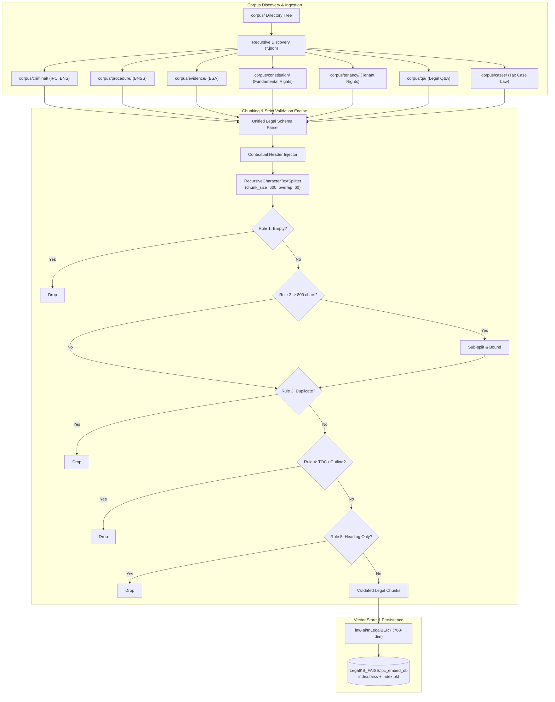

# LegalEagle v2 — Ingestion Pipeline Architecture Report

**Date**: September 18, 2026  
**Module**: RAG Data Ingestion & Indexing Subsystem  
**Phase**: Phase 5 — Ingestion Pipeline Improvements

---

## 1. Overview & Architectural Objectives

The LegalEagle v2 ingestion pipeline (`rebuild_index.py`) has been upgraded from a single-file IPC loader into a multi-domain, metadata-aware ingestion engine. 

### Core Design Goals
1. **Decoupled Architecture**: Ingestion, validation, chunking, and index building are completely decoupled from runtime serving.
2. **Recursive Domain Ingestion**: Dynamically discovers and ingests all legal acts across arbitrary directory depths within `corpus/`.
3. **Strict Validation Safeguards**: Every candidate chunk is passed through 5 hard validation filters before vectorization to guarantee high retrieval density and eliminate noise.
4. **Unified Multi-Domain Metadata**: Retains rich legal metadata (`id`, `act`, `section`, `title`, `year`, `domain`, `source_type`) attached to every vector in FAISS.

---

## 2. Ingestion Pipeline Data Flow



---

## 3. Strict Validation Rules Implemented

| Rule # | Validation Rule | Implementation Logic | Purpose |
| :--- | :--- | :--- | :--- |
| **Rule 1** | **No Empty Chunks** | `len(chunk.strip()) > 0` | Prevents zero-vector indexing and division-by-zero embeddings. |
| **Rule 2** | **Hard Size Upper Bound** | `len(chunk) <= 800` chars; if exceeded, sub-split or truncated | Prevents truncation anomalies inside InLegalBERT (512 max token limit). |
| **Rule 3** | **No Duplicate Chunks** | Hash set deduplication on whitespace-normalized lowercase text (`seen_hashes`) | Eliminates redundancy caused by overlapping legal summaries. |
| **Rule 4** | **No Table-of-Contents Chunks** | RegEx filter detecting `"table of contents"`, repeated dots/page numbers, or high-density section listing without text | Discards indexes, glossaries, or outlines that mislead semantic similarity. |
| **Rule 5** | **No Heading-Only Chunks** | Strip metadata headers; verify remaining substantive body has $\ge 25$ characters | Prevents empty title fragments from matching generic queries. |

---

## 4. Contextual Semantic Header Formatting

To prevent dense embeddings from losing statutory identity when chunked across sentences, a contextual header is dynamically prepended based on `source_type`:

1. **Statutes (`source_type: statute`)**:
   ```text
   Act: {act}
   Section/Article {section}: {title}

   {chunk_content}
   ```
2. **Legal Q&A (`source_type: qa`)**:
   ```text
   Domain: Legal Q&A
   Topic: {title}

   {chunk_content}
   ```
3. **Case Law Precedents (`source_type: case_law`)**:
   ```text
   Case Law: {title}
   Act: {act}

   {chunk_content}
   ```

---

## 5. Unified Corpus Schema

All input JSON documents in the corpus must satisfy the unified schema:

```json
{
  "id": "unique-slug-id",
  "act": "Name of Statute or Body of Law",
  "section": "Section or Article number",
  "title": "Title or short description",
  "year": "Statutory enactment year",
  "domain": "criminal_law | procedural_law | law_of_evidence | constitutional_law | tenancy_law | tax_law | legal_qa",
  "source_type": "statute | case_law | qa | treatise",
  "content": "Full statutory or explanatory text"
}
```

---

## 6. Extensibility for Future Legal Acts

The ingestion engine is fully future-proofed:
- Adding a new legal act (such as the Companies Act, Arbitration and Conciliation Act, or Motor Vehicles Act) requires only dropping a valid JSON file into an appropriate domain folder under `corpus/`.
- Running `python rebuild_index.py` automatically scans, validates, chunks, embeds, and updates the FAISS vector database without modifying a single line of code.
